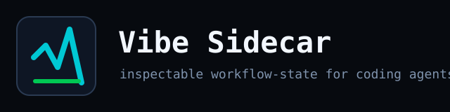
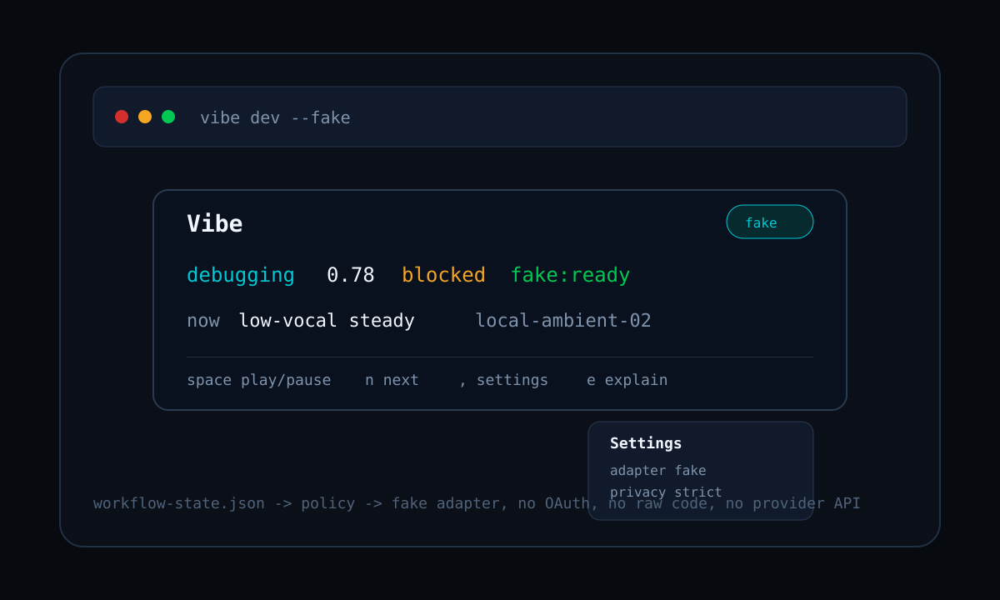

# Coding Vibe



Local, inspectable workflow-state sidecar for coding agents.

Coding Vibe watches safe development signals, reduces them into an auditable workflow-state document, and maps that state to ambient work intent. Music is an adapter, not the core product.

V1 is CLI-first and fake-adapter only. It does not connect to real music providers, OAuth, cloud services, or LLMs.

## Why

Agent-heavy developers lose situational awareness during long coding loops: tests run in the background, CI finishes unnoticed, agents stall, docs mode gets interrupted, and debugging or refactor phases blur together.

Coding Vibe tests whether a local, inspectable workflow-state sidecar can make those phases visible without reading source code, prompts, raw logs, OAuth tokens, or account data.

## What V1 Does

- Defines `workflow-state.schema.json` as the safe state contract.
- Validates workflow-state JSON with a CLI command.
- Ships example workflow states, policies, and fake candidates.
- Keeps provider integrations out of V1.
- Keeps MCP as a planned V1.1 surface, not the first implementation risk.

## What V1 Does Not Do

- No Spotify, Apple Music, YouTube Music, NetEase Cloud Music, or QQ Music integration.
- No OAuth.
- No LLM policy.
- No cloud sync.
- No source-code capture.
- No prompt capture.
- No terminal-output capture.
- No browser-history capture.

## Architecture

```text
sample events / fake watcher
        ↓
safe state extractor
        ↓
vibe-state.json
        ↓
deterministic policy
        ↓
fake/local adapter
        ↓
compact terminal UI / logs
```

The trust boundary is the product: all adapter actions should be explainable from the local workflow-state file and policy result.



## Quick Start

```bash
npm install
npm run build
node dist/cli.js --help
node dist/cli.js validate examples/workflow-state.min.json
```

Expected validation output:

```text
Valid workflow state: examples/workflow-state.min.json
```

Current commands:

```bash
node dist/cli.js init
node dist/cli.js dev --fake
node dist/cli.js state
node dist/cli.js explain
node dist/cli.js validate examples/workflow-state.min.json
node dist/cli.js mcp
```

`node dist/cli.js mcp` starts a stdio MCP server with safe local tools:

- `get_workflow_state`: read the current safe workflow-state summary.
- `explain_policy`: explain the latest local policy decision.
- `list_available_vibes`: list supported fake workflow modes.
- `set_fake_vibe`: write a local fake vibe and policy decision.

The MCP server does not expose provider APIs, OAuth tokens, raw source code, raw logs, browser data, or arbitrary shell access.

During `dev --fake`:

- `space`: play/pause fake adapter state.
- `n`: next candidate.
- `,`: settings.
- `e`: explain current policy decision.
- `s`: print current workflow state JSON.
- `q`: quit.

## Core Artifact

The durable interface is `workflow-state.schema.json`: a safe, local, inspectable summary of coding workflow state.

Minimal state:

```json
{
  "schema_version": "1.0.0",
  "producer": "coding-vibe",
  "generated_at": "2026-05-20T00:00:00.000Z",
  "ttl_ms": 30000,
  "workflow": {
    "mode": "unknown",
    "confidence": 0,
    "signals": []
  },
  "safety": {
    "redactions_applied": [],
    "forbidden_fields_seen": false
  }
}
```

## Privacy Model

Allowed model-visible data:

- Derived workflow mode.
- Confidence score.
- Coarse activity class.
- Timestamps.
- Redaction metadata.
- Local schema version.

Forbidden in V1:

- Raw prompts.
- Chat transcripts.
- Source code.
- Terminal output.
- Absolute file paths.
- Browser URLs.
- API keys, tokens, cookies, and secrets.
- OAuth credentials.
- Provider account identifiers.

## UI Direction

The V1 front end is a compact terminal widget, not a full-screen dashboard:

```text
┌─ Vibe ─────────────────────────────────┐
│ debugging  0.78  blocked  fake:ready   │
│ now low-vocal steady  local-ambient-02  │
│ space play/pause  n next  , settings   │
└────────────────────────────────────────┘
```

The first UI only needs current workflow state, current fake/local candidate, connection status, next, play/pause, settings, and explain.

## Provider Plugins

Provider integrations are future plugin/SPI work. Core owns the workflow-state schema, privacy rules, policy engine, and adapter contract. Provider-specific adapters should live outside core unless they are fake or local reference implementations.

Potential future adapters:

- local files
- MPD
- VLC
- Spotify
- Apple Music
- YouTube Music
- NetEase Cloud Music
- QQ Music

Non-official adapters should be marked experimental and must declare their capabilities and privacy surface.

## Development

```bash
npm install
npm run typecheck
npm test
npm run build
```

## Roadmap

- Slice 1: TypeScript CLI scaffold and schema validation. Done.
- Slice 2: Policy engine and explain output.
- Slice 3: Fake watcher and atomic `vibe-state.json` writes.
- Slice 4: Fake adapter and `adapter-log.jsonl`.
- Slice 5: Compact TUI.
- Slice 6: External validation script.

## License

Core daemon, CLI, policy engine, and sidecar code: `AGPL-3.0-or-later`.

Schemas, examples, sample vibe packs, and fake adapter sample data are intended to use a permissive license before distribution.
